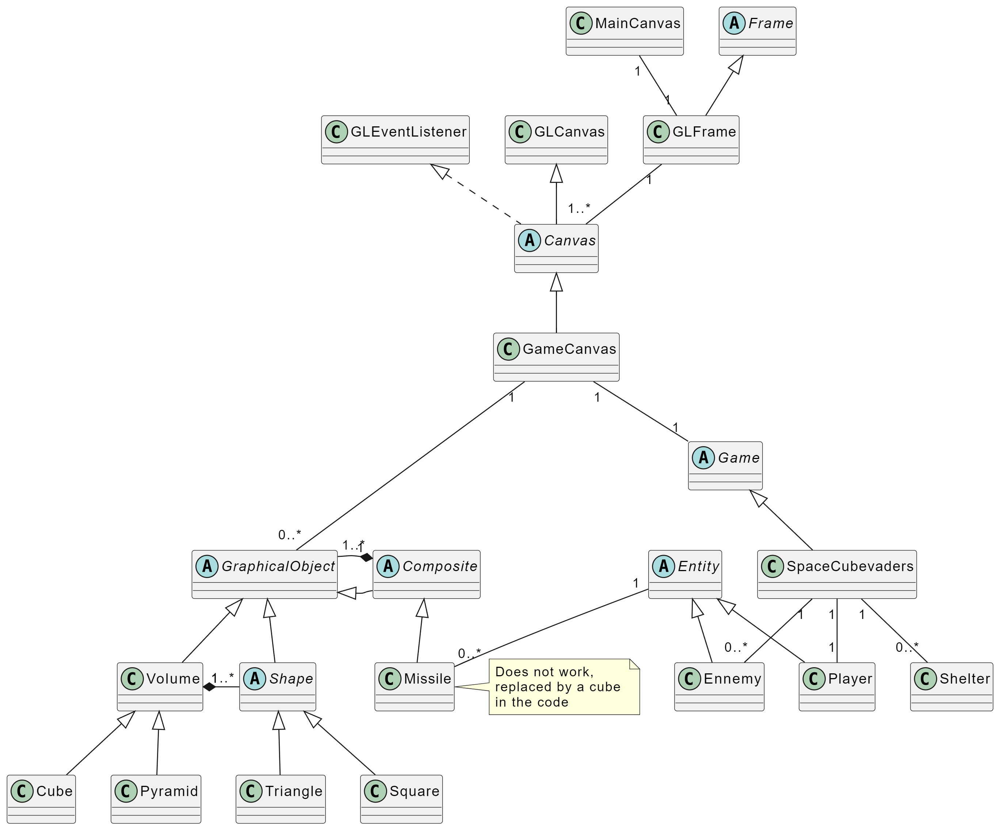

# Contributing to SpaceCubevaders

All information related to contributing to the project can be found in this file. It is **mandatory** to read it before contributing to the project in order to follow the conventions and make the development process easier for everyone. Thank you for your understanding!

- [Contributing to SpaceCubevaders](#contributing-to-spacecubevaders)
	- [Getting the Project](#getting-the-project)
	- [Project Conventions](#project-conventions)
		- [Versioning](#versioning)
		- [Git](#git)
		- [Code](#code)
			- [Indentation](#indentation)
			- [Code Quality](#code-quality)
	- [Technical Design](#technical-design)
		- [Diagrams and schemas](#diagrams-and-schemas)
		- [Development Environment](#development-environment)
		- [Structure](#structure)
		- [Displaying an Object](#displaying-an-object)

## Getting the Project

The project is hosted in an online repository. It is recommended to associate your SSH keys with your account to clone the project via SSH for security reasons, but it is also possible to clone it via HTTPS.

Navigate to the folder where you want to clone the project (after creating it):  
On Windows:

```bat
cd %userprofile%\Documents\Projects\SpaceCubevaders\
```

On Linux:

```bash
cd ~/projects/SpaceCubevaders/
```

Clone via SSH:  

```bash
git clone git@github.com:MichaelAceAnderson/SpaceCubevaders.git
```

Clone via HTTPS

```bash
git clone https://github.com/SpaceCubevadersApp/SpaceCubevaders.git
```

## Project Conventions

### Versioning

This project adheres to [Semantic Versioning](https://semver.org/). The version number is composed of three parts: major, minor, and patch. The version number is incremented according to the following rules:

- Major: making all related apps in previous versions incompatible with the current version
- Minor: added functionality in a backwards-compatible manner
- Patch: backwards-compatible bug fixes

Generally, versions must be incremented according to the following rules:

- breaking change: +1.0.0
- new feature: +0.1.0
- bug fix: +0.0.1
- other (refactor, indentation, ...): +0.0.01

### Git

⚠️ **Warning**: Always test your code and try to remove errors/warnings before commiting and/or submitting a pull request.  

- Commits should clearly describe their content and remain short. The commit message should be in English and include both the type of commit and the scope of the changes. If the change is global or not related to a specific feature/place in the code, the scope is optionnal.  
  ⚠️If the changes are related to an issue, the scope **must** be the issue number.
  - [Conventional Commits](https://www.conventionalcommits.org/en/v1.0.0/)
    - `feat(scope)`: new feature (e.g., *feat(#1): authentication*)
    - `fix(scope)`: bug fix (e.g., *fix(#2): fixed communication problem regarding login*)
    - `docs(scope)`: documentation (e.g., *docs(#3): updated README*)
    - `style(scope)`: changes that do not affect the code (spacing, formatting, etc.) (e.g., *style: fixed indentation*)
    - `refactor(scope)`: code changes that neither fix a bug nor add a feature (e.g., *refactor(#5): optimized code*)
    - `perf(scope)`: performance improvement (e.g., *perf(#6): improved speed*)
    - `test(scope)`: adding or modifying tests (e.g., *test(#7): added unit tests*)
    - `conf(scope)`: build configuration changes (e.g., *conf(#8): updated Dockerfile*)
    - `chore(scope)`: changes to the development environment or project organization (e.g., *chore(#9): updated .gitignore*)
- Every branch must be associated with one type of change (see below) and be created from the `develop` branch. Everytime you finish changes on a branch, you must have it reviewed and merged back into `develop` so that the branch can be deleted and the changes can be integrated into the project. When enough features are ready, it is then possible to merge `develop` into `release/x.x.x` depending on the version number, then make small changes on the release branch in case of bugs, and finally merge the release branch into `main` to deploy the changes.
  - [Gitflow](https://www.atlassian.com/git/tutorials/comparing-workflows/gitflow-workflow)
    - `feat/xxxx-name-of-the-feature`: New feature referenced by the issue number and a short description (e.g., `feat/1-authentication`)
    - `fix/xxxx-name-of-the-fix`: Bug fix referenced by the issue number and a short description (e.g., `fix/2-login-error`)
    - `docs/xxxx-name-of-the-docs`: Documentation referenced by the issue number and a short description (e.g., `docs/3-readme`)
    - `style/xxxx-name-of-the-style`: Style changes referenced by the issue number and a short description (e.g., `style/4-indentation`)
    - `refactor/xxxx-name-of-the-refactor`: Refactoring referenced by the issue number and a short description (e.g., `refactor/5-optimization`)
    - `perf/xxxx-name-of-the-perf`: Performance improvement referenced by the issue number and a short description (e.g., `perf/6-speed`)
    - `test/xxxx-name-of-the-test`: Test changes referenced by the issue number and a short description (e.g., `test/7-unit`)

### Code

#### Indentation

Indentation must be done with tabs and not spaces.  
Use the [Prettier](https://prettier.io/) code formatter to ensure consistent code style. [Prettier for VSCode](https://marketplace.visualstudio.com/items?itemName=esbenp.prettier-vscode)

#### Code Quality

- Use LF line endings
- Your code must be as modulable and easily reusable as possible. Separate your code into functions and classes as much as possible, avoid long functions and try to separate the data logic from the UI logic as much as possible.
- Files should be grouped into a folder hierarchy according to their role
- Your code must be as self-explanatory as possible. If you cannot find a way to make it so, comment "why" and not "how" you did it
- Explicitly name variables and functions (which should remain short) to avoid the need for comments
- File, folder, variable names, and code in general must be in English
- Comments must be in English
- Variables and functions must follow the conventions of their respective language
  - Java:
    - [Code Conventions for the Java Programming Language](https://www.oracle.com/java/technologies/javase/codeconventions-contents.html)
    - camelCase for variables and functions
    - PascalCase for classes
    - SCREAMING_SNAKE_CASE for constants

## Technical Design

This project is designed to be easily extendable and support multiple games. It includes a graphical and informational debug mode, with parameters available in the [/src/common/DebugMode.java](src/common/Debug.java) class. These modes can be dynamically changed and are defined in the program's entry point (MainCanvas or DebugGL). Feel free to experiment with them to understand how the rendering works.

### Diagrams and schemas

Design documents can be found in the [docs](_docs/) folder, including:

- PlantUML data model: [UML](_docs/UML.plantuml)  
  

### Development Environment

For reference, here are the latest tested versions of the applications used for the project:

| Component     | Version     |
|---------------|-------------|
| Java          | 15.0.2      |

### Structure

The project is divided into several parts based on the roles of the code:

- [**common**](src/common/): contains classes common to all packages, including constants and utility classes
- [**games**](src/games/): contains classes for managing game construction rules
  - [**rules**](src/games/rules/): contains classes for managing game construction rules
  - [**spacecubevaders**](src/games/spacecubevaders/): contains classes for managing the Space Cubevaders game
    - [**assets**](src/games/spacecubevaders/assets/): contains game assets (images, sounds, etc.)
    - [**entities**](src/games/spacecubevaders/entities/): contains classes for managing game entities (Player, enemy, etc.)
      - [**rules**](src/games/spacecubevaders/entities/rules/): contains classes for managing entity construction rules
    - [**items**](src/games/spacecubevaders/items/): contains classes for managing game items (missile, etc.)
    - [**structures**](src/games/spacecubevaders/structures/): contains classes for managing game structures (shelters, etc.)
- [**gl**](src/gl/): contains classes for managing game rendering
  - [**frames**](src/gl/frames/): contains classes for managing windows
    - [**rules**](src/gl/frames/rules/): contains classes for managing window construction rules
  - [**canvas**](src/gl/canvas/): contains classes for managing game rendering frames
    - [**rules**](src/gl/canvas/rules/): contains classes for managing rendering frame construction rules
  - [**objects**](src/gl/objects/):
    - [**rules**](src/gl/objects/rules/): contains classes for managing graphical object construction rules
    - [**shapes**](src/gl/objects/shapes/): contains classes for geometric shapes (square, triangle, etc.) used to construct volumes
    - [**volumes**](src/gl/objects/volumes/): contains classes for volumes (cubes, pyramids, etc.) used to construct 3D objects
- [**main**](src/main/): contains classes for program launch and debugging

### Displaying an Object

To display an object, it must be drawn and then placed in space.
A graphical object ([GraphicalObject](src/objects/rules/GraphicalObject.java)) can be a geometric shape ([Shape](src/objects/rules/Shape.java)) or a volume ([Volume](src/objects/rules/Volume.java)).  
Creating a shape involves creating a file in the **shapes** package that implements the methods inherited from [Shape](src/objects/rules/Shape.java).  
Creating a volume involves creating a file in the **volumes** package that implements the methods inherited from [Volume](src/objects/rules/Volume.java) and is drawn using a set of geometric shapes ([Shape](src/objects/rules/Shape.java)).

OpenGL works with a stack system. Each object display must be framed by a `glPushMatrix()` and a `glPopMatrix()`, within which transformations can be performed ([glTranslate](https://www.khronos.org/registry/OpenGL-Refpages/gl2.1/xhtml/glTranslate.xml), [glRotate](https://www.khronos.org/registry/OpenGL-Refpages/gl2.1/xhtml/glRotate.xml), [glScale](https://www.khronos.org/registry/OpenGL-Refpages/gl2.1/xhtml/glScale.xml)).  
Note that transformations are applied in the reverse order of their call due to the way transformations are performed by matrix multiplication.
To display an object, you need to:

- call `glPushMatrix()` to save the current state matrix at the top of the stack
- perform the necessary transformations
- draw the objects
- call `glPopMatrix()` to restore the previously saved state matrix
- repeat for each object with its own transformations

These operations are found in the `display()` method of [GraphicalObject](src/objects/rules/GraphicalObject.java).

Note that displays are recursive since drawing a volume requires calling display on each of its composing geometric shapes.  
Example:

```java
/* Display a volume */
public void display() {
 // Save the current matrix
 this.getGl().glPushMatrix();
 {
  // Move the graphical object
  [...]
  // Rotate the graphical object
  [...]
  // Scale the graphical object
  [...]
  // Draw the graphical object at position 0,0,0 before moving it to its actual position
  this.draw();
  // Draw the collisions at position 0,0,0 before moving the graphical object to its actual position
  this.drawCollisions();
 }
 // Restore the previous matrix
 this.getGl().glPopMatrix();
}

/* Draw the volume */
public void draw() {
 // Drawing this volume involves displaying all the shapes that compose it
 for (Shape shape : this.getShapes()) {
  shape.display();
 }
}
```
